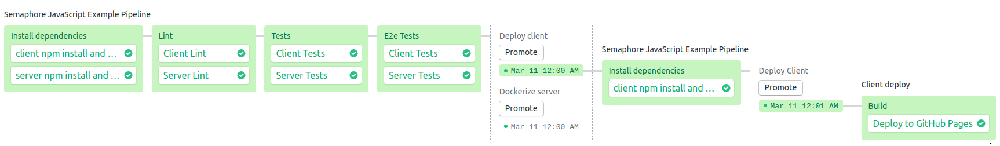
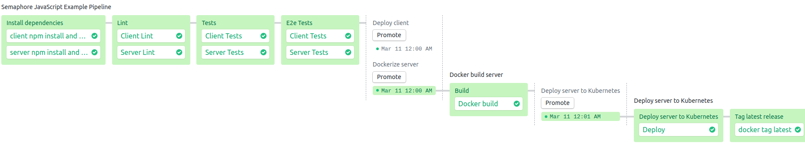

# Semaphore demo CI/CD pipeline using JavaScript (Node.js, TypeScript, Nest.js, React)

Example application and CI/CD pipeline showing how to run a JavaScript project
on Semaphore 2.0. Project consists of a Node.js server based on Nest.js, and a
React client. Code is written in TypeScript.

## CI/CD on Semaphore

Fork this repository and use it to [create a
project](https://docs.semaphoreci.com/article/63-your-first-project).

The CI pipeline will look like this:





The example pipeline contains 4 blocks:

 - Install Dependencies
    -  installs and caches all npm dependencies
 - Run Lint
    - Runs tslint to check project files codestyle
 - Run Unit Tests
    - Runs Unit Tests
 - Run E2E Tests
    - Runs E2E tests through cypress on client.
    - Runs E2E tests through jest on server.

Then, if all checks are ok, we move to build pipeline. It consists of one block

 - Build
   - Build client- build client app using create-react-app sctipts
   - Build server - build container and push it into google repository

Then, after we've built our apps we move to deploy pipeline.
It  also consists of one block for client and of two for server.
As you can see deploy pipelines of client and server depend only on their own build step
and therefore could be run in parallel.

 - Deploy
   - Deploy client - commit and push build into Google Cloud Storage bucket
   - Deploy server
      - Deploy server to k8s, pdate k8s deployment using deployment config
      - Tag container if all went well

## Local project setup

This project requires a PostgreSQL database. If you don't have one you can
launch a Docker container to have one.

### Configuration

```bash
$ cp .sample.env .env
```

### Launch db

```bash
$ docker-compose up
```

### Stop db

```bash
$ docker-compose down
```

### Configure and launch server

Steps described in server [README](src/server/README.md)

### Configure and launch client

Steps described in client [README](src/client/README.md)

## Deploy configuration

Check out `.semaphore/` folder - steps described there have helpful comments to help you figure out what commands are doing.
Also check out `.semaphore/secrets` folder. To configure deploy you need to create and populate all those secrets.
Copy each secret file into file without `.sample` in filename and populate it. All of them have useful description comments to help you out.

## License

Copyright (c) 2019 Rendered Text

Distributed under the MIT License. See the file [LICENSE.md](./LICENSE.md).
